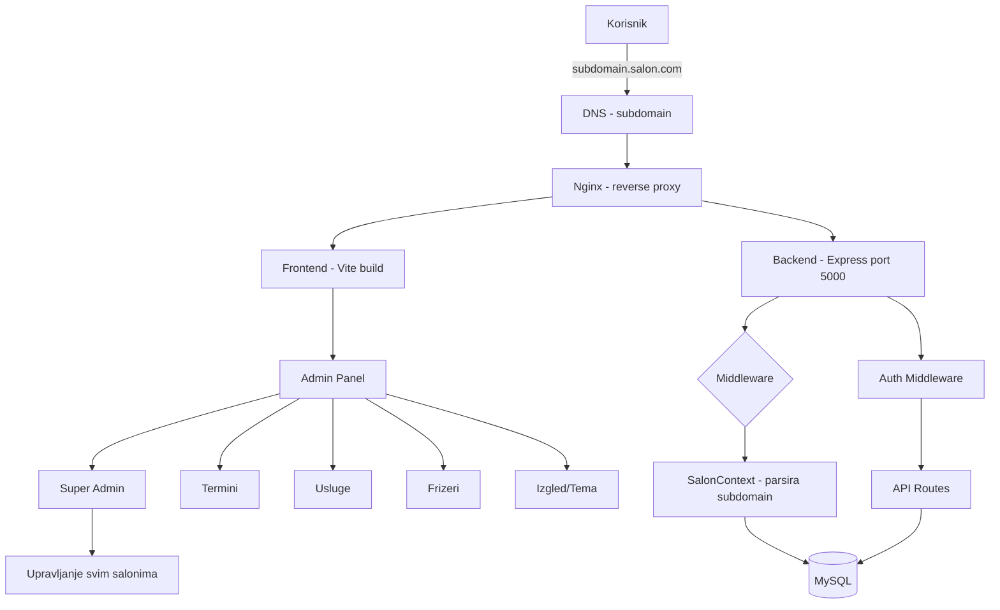

# Plan za produkciju - Frizerski Salon Booking

## 📋 Pregled trenutnog stanja

Projekat je **funkcionalan** ali ima nekoliko ključnih tačaka koje treba doraditi pre nego što ga ponudimo frizerima (bilo kao SaaS iznajmljivanje ili jednokratna prodaja).

### Šta već radi ✅

- ✅ Multi-tenant arhitektura u bazi (salon_id u svim tabelama)
- ✅ Admin panel za upravljanje salonima (SALONI tab)
- ✅ Dinamičke teme (boje, fontovi) per salon
- ✅ Upload slika (hero, barberi, galerija)
- ✅ JWT autentifikacija
- ✅ Zakazivanje termina sa proverom zauzetosti
- ✅ Email notifikacije

---

## 1️⃣ 🔴 KRITIČNO: Pravilni subdomain → salon_id lookup

**Problem:** U svim backend rutama (`auth.js`, `appointments.js`, `barbers.js`, `services.js`, `gallery.js`) `getSalonId()` hardcode-uje `return 1`.

**Šta treba uraditi:**

1. Napraviti `getSalonId()` funkciju koja:
    - Čita Host header (`req.get("host")`)
    - Parsira subdomain (npr. `salon1.localhost:5173` → `salon1`)
    - Upituje bazu: `SELECT id FROM salons WHERE subdomain = ?`
    - Kešira rezultat za trajanje request-a
2. Dodati middleware na Express nivou koji postavlja `req.salonId`
3. Izmeniti sve rute da koriste `req.salonId` umesto `getSalonId(req)`

**Fajlovi za izmenu:** `backend/server.js`, `backend/routes/auth.js`, `backend/routes/appointments.js`, `backend/routes/barbers.js`, `backend/routes/services.js`, `backend/routes/gallery.js`

```javascript
// middleware/salonContext.js
async function salonContext(req, res, next) {
    const host = req.get("host") || "";
    const parts = host.split(".");
    let subdomain = "main";
    if (parts.length >= 3 && parts[0] !== "www" && parts[0] !== "localhost") {
        subdomain = parts[0];
    }

    // Fallback na query param (za admin API pozive)
    const querySubdomain = req.query.subdomain;
    if (querySubdomain) subdomain = querySubdomain;

    // DB lookup - bez keširanja za sada
    req.salonSubdomain = subdomain;
    // Koristi pool.query umesto db.query
    // SELECT id FROM salons WHERE subdomain = ? AND is_active = 1
    req.salonId = results[0]?.id || 1;
    next();
}
```

---

## 2️⃣ 🔴 KRITIČNO: Super admin panel

**Problem:** Trenutno admin može da vidi SAMO svoj salon. Super admin treba da vidi SVE salone i upravlja njima.

**Šta treba uraditi:**

### Backend:

1. Dodati polje `is_super_admin` u `users` tabelu (već postoji u auth.js liniji 133)
2. Napraviti middleware `isSuperAdmin` koji proverava ovo polje
3. Napraviti super-admin rute:
    - `GET /api/salons/all-super` - lista svih salona (samo super admin)
    - `PUT /api/salons/:id/activate` - aktiviraj/deaktiviraj salon
    - `GET /api/super/stats` - globalna statistika
    - `POST /api/super/clone-salon` - kloniraj podrazumevani salon za novog korisnika

### Frontend:

1. U `AdminPanel.jsx` dodati poseban tab "Super Admin" koji se prikazuje samo ako je `user.is_super_admin === true`
2. U tom tabu: lista svih salona, mogućnost aktivacije/deaktivacije, kreiranje novog

---

## 3️⃣ 🔴 KRITIČNO: Automatsko kloniranje pri kreiranju salona

**Problem:** Kad se kreira novi salon, dolazi sa praznom bazom - nema usluga, nema frizera, nema galerije.

**Šta treba uraditi:**

1. Napraviti API rutu `POST /api/salons/create-with-template` koja:
    - Kreira novi red u `salons` tabeli
    - Klonira sve usluge, barbere i galeriju iz "main" salona (ili template salona)
    - Postavi default vrednosti za temu, radno vreme
2. `SaloniTab.jsx` forma za kreiranje treba da pozove ovu rutu

```sql
-- Template query
INSERT INTO services (salon_id, name, duration, price, description, icon)
SELECT @newSalonId, name, duration, price, description, icon
FROM services WHERE salon_id = 1;
```

---

## 4️⃣ 🟡 VAŽNO: Email servis per-salon

**Problem:** Email se uvek šalje na `knezantonije@gmail.com`. Svaki salon treba da ima svoj email (salonov mejl ili frizerov mejl).

**Šta treba uraditi:**

1. `salons` tabela već ima kolonu `email` - koristiti je za notifikacije
2. Izmeniti `emailService.js` da prima `salonEmail` parametar
3. U `appointments.js` ruti, dohvatiti `salons.email` i proslediti u `sendSalonNotification`
4. Dodati polje "Email za notifikacije" u `AppearanceTab.jsx` formu

---

## 5️⃣ 🟡 VAŽNO: Rate limiting i security

**Problem:** Nema zaštite od brute-force napada ili prekomernih zahteva.

**Šta treba uraditi:**

1. Dodati `express-rate-limit` u backend
2. Rate limit na auth rute (5 pokušaja login-a po minutu)
3. Rate limit na appointment rute (10 zahteva po minutu po IP)
4. Sanitizacija inputa (već delimično radi kroz parametarizovane upite - dobro!)
5. Dodati CORS da dozvoljava samo frontend domen

```javascript
const rateLimit = require("express-rate-limit");

const authLimiter = rateLimit({
    windowMs: 60 * 1000, // 1 minut
    max: 5, // 5 pokušaja
    message: { error: "Previše pokušaja, sačekajte minut" },
});

app.use("/api/auth/login", authLimiter);
```

---

## 6️⃣ 🟢 PREDLOG: Landing/Demo stranica

**Problem:** Kad potencijalni kupac dođe na tvoj sajt, nema jasne informacije da se ovo prodaje/iznajmljuje.

**Šta treba uraditi:**

1. Napraviti novu stranicu `LandingPage.jsx` ili dodati sekciju na postojeću `HomePage`
2. Na root domenu (`main`) prikazati "promo" sadržaj:
    - "Profesionalni sistem za zakazivanje za vaš frizerski salon"
    - Cene (mesečna pretplata ili jednokratna kupovina)
    - Demo booking forma
    - Kontakt za kupovinu
3. Za ostale salone (subdomain) prikazati normalan salon sadržaj

---

## 7️⃣ 🟢 PREDLOG: Dokumentacija za korisnike

Napraviti uputstvo za frizere koji kupuju sajt:

1. `README.md` na nivou projekta sa instrukcijama
2. Admin uputstvo (PDF ili HTML):
    - Kako dodati/izmeniti usluge
    - Kako dodati nove frizere
    - Kako izmeniti izgled (boje, logo, hero slika)
    - Kako pregledati termine
    - Kako podesiti svoje radno vreme per frizer

---

## 📊 Arhitektura - dijagram toka



---

## 📅 Redosled izvršavanja

### Faza 1: Osnove (pre deploy-a na server)

1. **Subdomain → salon_id lookup** (kritično za multi-tenant)
2. **Super admin panel** (da možeš da upravljaš svim salonima)
3. **Kloniranje template-a** (da novi salon dobije default podatke)

### Faza 2: Sigurnost i email

4. **Email per-salon** (svaki salon ima svoj email)
5. **Rate limiting** (zaštita od napada)

### Faza 3: Prodaja i dokumentacija

6. **Landing page za prodaju**
7. **Dokumentacija za korisnike**
8. **Deploy na server** (sa svim migracijama)
