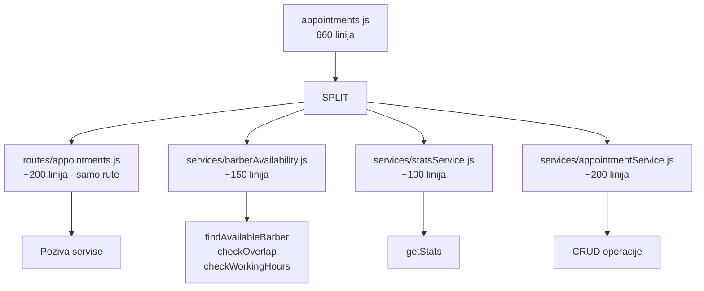
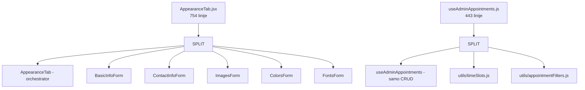

# Plan refaktorisanja - Smanjenje velikih fajlova

## Pregled problema

Trenutno stanje otkriva nekoliko fajlova koji su **pregolemi** i krše princip "jedna odgovornost" (Single Responsibility Principle):

### 🔴 Kritični fajlovi (500+ linija)

| Fajl                                              | Linija | Problem                               |
| ------------------------------------------------- | ------ | ------------------------------------- |
| `backend/routes/appointments.js`                  | 660    | Poslovna logika pomiješana sa rutama  |
| `frontend/src/components/admin/AppearanceTab.jsx` | 754    | Monolitan form sa svim poljima inline |
| `frontend/src/components/admin/SaloniTab.jsx`     | 529    | CRUD + forme inline                   |

### 🟡 Veliki fajlovi (300-500 linija)

| Fajl                                                | Linija | Problem                       |
| --------------------------------------------------- | ------ | ----------------------------- |
| `frontend/src/components/admin/BarbersTab.jsx`      | 466    | Forma za frizere inline       |
| `frontend/src/hooks/useAdminAppointments.js`        | 443    | Previše logike u jednom hooku |
| `frontend/src/components/admin/GalleryTab.jsx`      | 441    | Upload + URL logika inline    |
| `frontend/src/components/admin/StatsTab.jsx`        | 335    | Stats + filteri inline        |
| `frontend/src/components/admin/AppointmentsTab.jsx` | 313    | Tabela + modal inline         |

---

## Plan refaktorisanja

### 1. Backend: `backend/routes/appointments.js` (660 → ~200 linija)

**Cilj:** Izdvojiti poslovnu logiku u servis sloj.

```
backend/
├── routes/
│   └── appointments.js          ← samo rute (~200 linija)
├── services/
│   ├── appointmentService.js     ← CRUD + business logic (~200 linija)
│   ├── barberAvailability.js     ← findAvailableBarber, checkOverlap, checkWorkingHours (~150 linija)
│   └── statsService.js          ← stats queries (~100 linija)
```

**Koraci:**

1. Kreirati `backend/services/barberAvailability.js` sa funkcijama:
    - `findAvailableBarber(salonId, date, time, serviceDuration, preferredBarberId)`
    - `checkBarberOverlap(salonId, barberId, date, time, service, excludeId)`
    - `checkBarberWorkingHours(salonId, barberId, date, time, service)`

2. Kreirati `backend/services/statsService.js` sa funkcijom:
    - `getStats(salonId, period, startDate, endDate)` — vraća kompletan stats objekat

3. Kreirati `backend/services/appointmentService.js` sa CRUD funkcijama:
    - `getAll(salonId)`
    - `getByDate(salonId, date)`
    - `getByDateAndBarber(salonId, date, barberId)`
    - `getByPhone(salonId, phone)`
    - `create(salonId, data)`
    - `update(salonId, id, data)`
    - `delete(salonId, id)`

4. Refaktorisati `backend/routes/appointments.js` da samo poziva servise

---

### 2. Frontend: `frontend/src/components/admin/AppearanceTab.jsx` (754 → ~300 linija)

**Cilj:** Izdvojiti forme u zasebne komponente.

```
frontend/src/components/admin/
├── AppearanceTab.jsx                  ← orchestrator (~100 linija)
├── appearance/
│   ├── BasicInfoForm.jsx              ← osnovne informacije (~60 linija)
│   ├── ContactInfoForm.jsx            ← kontakt informacije (~50 linija)
│   ├── ImagesForm.jsx                 ← logo + hero slike (~100 linija)
│   ├── ColorsForm.jsx                 ← svi color pickeri (~150 linija)
│   └── FontsForm.jsx                  ← fontovi (~80 linija)
```

**Koraci:**

1. Kreirati `frontend/src/components/admin/appearance/` direktorijum
2. Izdvojiti svaku sekciju forme u posebnu komponentu
3. Svaka komponenta prima `form`, `handleChange` i specifične propove
4. `AppearanceTab` postaje orchestrator koji samo kompozira forme

---

### 3. Frontend: `frontend/src/components/admin/SaloniTab.jsx` (529 → ~200 linija)

**Cilj:** Izdvojiti formu za kreiranje/uređivanje salona.

```
frontend/src/components/admin/
├── SaloniTab.jsx                  ← lista + modal (~100 linija)
├── salon/
│   └── SalonForm.jsx              ← forma za salon (~150 linija)
```

---

### 4. Frontend: `frontend/src/components/admin/BarbersTab.jsx` (466 → ~200 linija)

**Cilj:** Izdvojiti formu za frizere.

```
frontend/src/components/admin/
├── BarbersTab.jsx                 ← lista + modal (~100 linija)
├── barber/
│   └── BarberForm.jsx             ← forma za frizere (~150 linija)
```

---

### 5. Frontend: `frontend/src/hooks/useAdminAppointments.js` (443 → ~200 linija)

**Cilj:** Izdvojiti utilitne funkcije za slotove i filtriranje.

```
frontend/src/
├── hooks/
│   └── useAdminAppointments.js    ← samo state + CRUD akcije (~200 linija)
├── utils/
│   ├── timeSlots.js               ← generateTimeSlots, filterSlotsByBarber (~80 linija)
│   └── appointmentFilters.js      ← filter + sort appointments (~50 linija)
```

---

### 6. Frontend: `frontend/src/components/admin/GalleryTab.jsx` (441 → ~200 linija)

**Cilj:** Izdvojiti formu za dodavanje slika.

```
frontend/src/components/admin/
├── GalleryTab.jsx                 ← galerija + modal (~100 linija)
├── gallery/
│   └── GalleryAddForm.jsx         ← upload + URL forma (~100 linija)
```

---

### 7. Frontend: `frontend/src/components/admin/AppointmentsTab.jsx` (313 → ~180 linija)

**Cilj:** Izdvojiti modal za uređivanje termina.

```
frontend/src/components/admin/
├── AppointmentsTab.jsx            ← tabela + modali (~100 linija)
├── appointment/
│   └── EditAppointmentForm.jsx    ← forma za izmijenu termina (~120 linija)
```

---

### 8. Frontend: `frontend/src/services/appointmentService.js` (188 → ~100 linija)

**Cilj:** Eliminisati duplikaciju try/catch blokova.

```javascript
// Prijedlog: koristiti jedan helper wrapper
const apiCall = async (method, url, data) => {
    try {
        const response = await requestInstance[method](url, data);
        return response.data;
    } catch (error) {
        throw error.response?.data || { error: "Greška na serveru" };
    }
};
```

---

### 9. Frontend: `frontend/src/context/AuthContext.jsx` (160 → ~120 linija)

**Cilj:** Izdvojiti `decodeToken` u `utils/jwt.js`.

---

## Prioriteti izvršenja

| Prioritet | Šta                              | Zašto                                      |
| --------- | -------------------------------- | ------------------------------------------ |
| 1         | `backend/routes/appointments.js` | Najveći backend fajl, miješa logiku i rute |
| 2         | `AppearanceTab.jsx`              | Najveći frontend fajl, 754 linije          |
| 3         | `useAdminAppointments.js`        | 443 linije, teško održavati                |
| 4         | `SaloniTab.jsx`                  | 529 linija                                 |
| 5         | `BarbersTab.jsx`                 | 466 linija                                 |
| 6         | `GalleryTab.jsx`                 | 441 linija                                 |
| 7         | `AppointmentsTab.jsx`            | 313 linija                                 |
| 8         | `StatsTab.jsx`                   | 335 linija                                 |
| 9         | `appointmentService.js`          | 188 linija, duplikacija koda               |

---

## Diagram toka refaktorisanja (backend)



## Diagram toka refaktorisanja (frontend)



---

## Napomena

Svaki refaktorisani fajl treba da:

1. Zadrži **potpuno istu funkcionalnost**
2. Bude **testiran** nakon promjene (aplikacija i dalje radi)
3. Ne mijenja **API ugovore** (isti importi/exporti)
